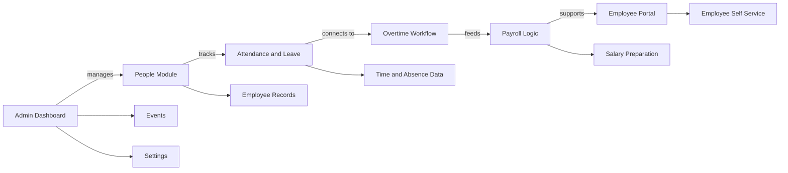
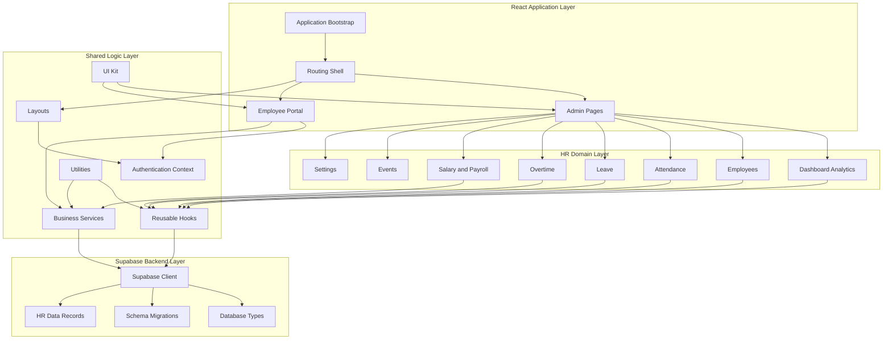
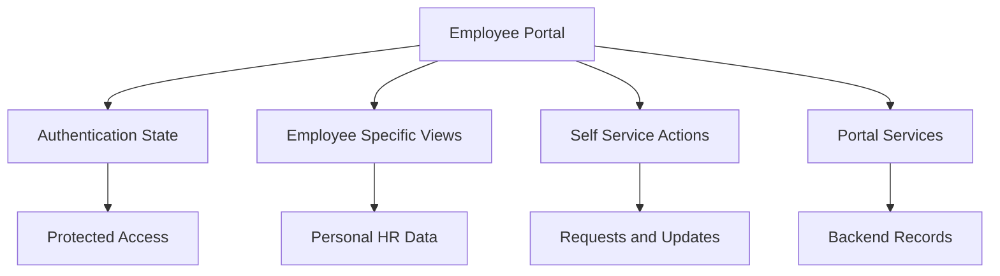
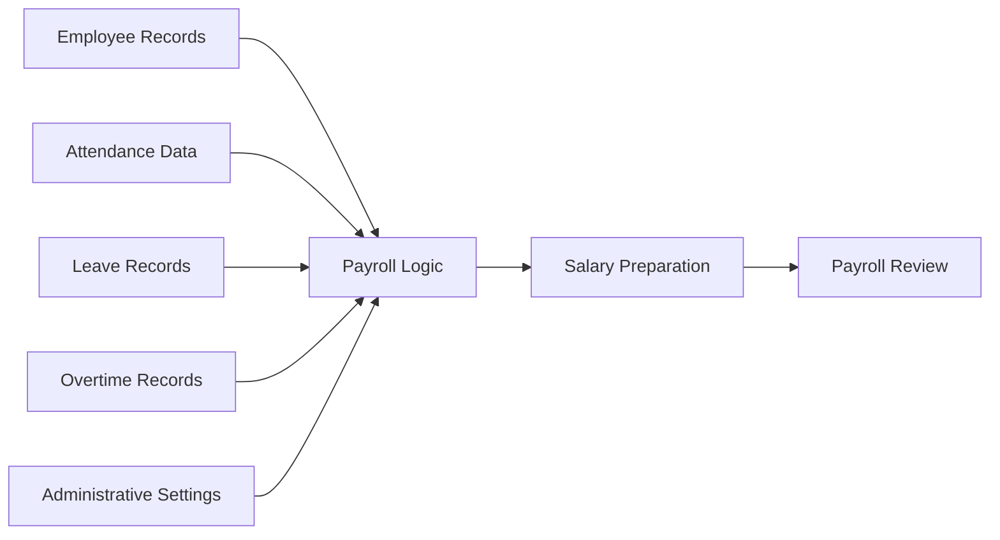
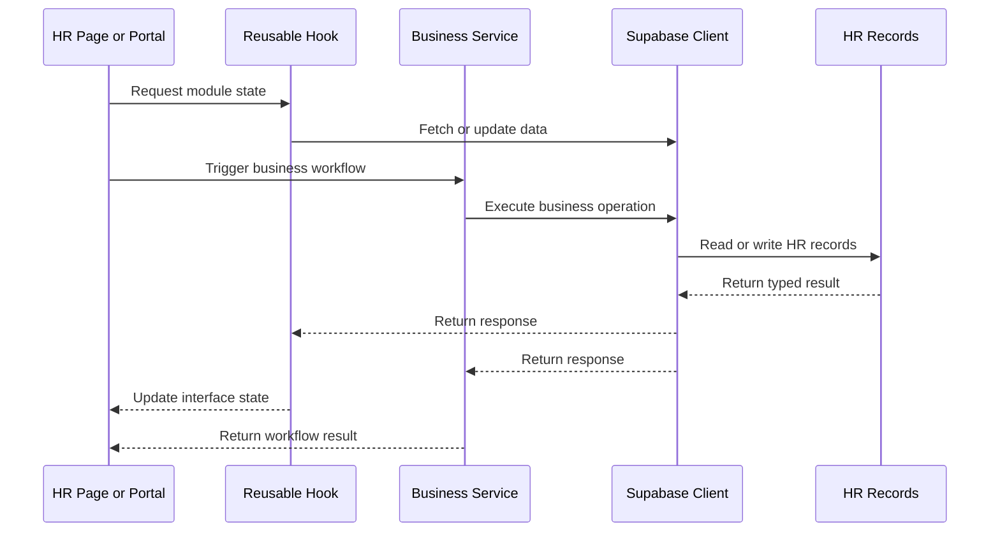

# AdiCorp

  <strong>Modular Human Resource Management System for employee operations, attendance tracking, leave workflows, payroll logic, overtime management, events, settings, and employee self service.</strong>

  
  
  
  
  

---

## Overview

AdiCorp is a modular Human Resource Management System designed to support core workforce operations through a structured admin dashboard and an employee self service portal.

The system focuses on practical HR workflows such as employee record management, attendance tracking, leave management, overtime handling, salary preparation, event scheduling, administrative configuration, and employee portal access. AdiCorp is designed as a scalable business application where HR operations, shared logic, reusable components, and backend data workflows are organized into clear architectural layers.

AdiCorp is not only a dashboard interface. The project represents a structured HRMS foundation where admin workflows, employee facing experiences, business rules, shared state, reusable hooks, UI systems, and Supabase backed records work together as one product.

---

## Project Vision

The vision behind AdiCorp is to create a clean and extensible HR platform that can support daily business operations while remaining maintainable from an engineering perspective.

Many HR systems become difficult to scale because employee data, attendance rules, payroll logic, leave policies, approval flows, and employee portal features are tightly mixed together. AdiCorp approaches the problem through modular separation, where each HR domain can evolve independently while still sharing authentication, layouts, services, hooks, utilities, and backend integration.

The project is built around four core ideas:

- A centralized admin dashboard for HR operations
- A separate employee portal for self service workflows
- Domain based HR modules for workforce management
- Shared business logic and typed backend integration for maintainability

---

## Core Capabilities

### Admin Dashboard

The admin dashboard provides a central view for HR teams and administrators. It supports operational visibility across employees, attendance, leave, overtime, payroll, events, and settings.

### Employee Management

The employee module supports people focused workflows such as employee records, workforce profiles, organizational data, and HR related employee information.

### Attendance Tracking

The attendance module supports time tracking workflows and provides a foundation for check in, check out, attendance summaries, and workforce presence management.

### Leave Management

The leave module supports absence workflows such as leave requests, leave records, leave status, and absence related HR operations.

### Overtime Management

The overtime module supports policy based overtime workflows where additional work time can be tracked, reviewed, and connected to payroll logic.

### Salary and Payroll Logic

The salary module supports payroll related preparation and calculation workflows. This layer represents the business logic needed for salary handling, adjustments, and HR financial operations.

### Events and Scheduling

The events module supports HR scheduling, internal events, calendar related workflows, and employee communication use cases.

### Settings and Administration

The settings module supports administrative configuration for the HR platform and provides a place for system level HR preferences and rules.

### Employee Portal

The employee portal provides a separate experience for employee facing workflows. This is important because admin users and employees require different interfaces, permissions, and interactions.

---

## Product Workflow

AdiCorp connects daily HR operations into a structured product workflow.

1. The admin dashboard provides a centralized HR control center.
2. The people module manages employee records and workforce information.
3. Attendance, leave, and overtime modules handle time and absence workflows.
4. Payroll logic prepares salary related operations based on rules and records.
5. Events and settings support scheduling and administrative configuration.
6. The employee portal provides self service access for employee facing workflows.
7. Shared layouts, authentication, hooks, services, UI components, and utilities support the full platform.
8. Supabase backed records provide the persistent data layer for HR operations.

---

## Architecture Philosophy

AdiCorp follows a layered architecture where product areas, domain modules, shared logic, and backend services are separated clearly.

### React Application Layer

The application layer manages the entry point, routing shell, admin pages, and employee portal. This layer is responsible for organizing the user experience and directing users to the correct HR workflows.

### HR Domain Layer

The HR domain layer contains the major business modules of the platform. Each module is focused on a specific HR concern such as employees, attendance, leave, overtime, salary, events, dashboard analytics, or settings.

### Shared Logic Layer

The shared logic layer includes layouts, authentication state, reusable hooks, business services, UI primitives, and utilities. This layer keeps the platform consistent and prevents repeated logic across modules.

### Supabase Backend Layer

The backend layer provides typed access to persistent HR records, database schema types, and migration backed data structure. This layer supports the data requirements of the HRMS.

---

## HR Module Breakdown

### Dashboard Analytics

The dashboard module provides an overview of HR activity and operational visibility. It can summarize employees, attendance behavior, leave activity, payroll related signals, and workforce information.

### Employees Module

The employees module represents the people foundation of AdiCorp. It is responsible for employee records, workforce data, profile information, and HR employee management workflows.

### Attendance Module

The attendance module tracks workforce presence and time related information. It is designed to support HR visibility around employee working patterns and daily attendance activity.

### Leave Module

The leave module supports absence management. It provides a foundation for leave requests, absence records, review workflows, and leave related workforce planning.

### Overtime Module

The overtime module supports additional work time tracking and policy based overtime handling. This module is important for connecting time records with payroll preparation.

### Salary Module

The salary module handles payroll related business logic. It supports salary preparation, calculation rules, employee compensation workflows, and finance aligned HR operations.

### Events Module

The events module supports internal HR scheduling, company events, reminders, and workforce communication related workflows.

### Settings Module

The settings module supports administrative configuration and system level HR controls.

---

## Employee Portal Concept

AdiCorp separates admin operations from employee facing workflows. This distinction is important for HR platforms because administrators, HR teams, managers, and employees usually require different interfaces and responsibilities.

The employee portal concept supports:

- Self service visibility
- Employee specific workflows
- Access to personal HR information
- Isolation from admin only functions
- A cleaner experience for non administrative users

---

## Payroll and Attendance Relationship

Payroll systems depend on accurate records from attendance, leave, overtime, employee profiles, and administrative settings. AdiCorp reflects this relationship by keeping salary logic separated as a business service while allowing other HR modules to feed the payroll workflow.

---

## Data Flow

AdiCorp uses a structured data flow where pages and modules interact with hooks and services, while backend operations are handled through a typed Supabase client.

---

## Technical Design

### Modular Domain Structure

AdiCorp separates HR responsibilities into independent modules. This helps every part of the system remain easier to understand, extend, and maintain.

### Shared Authentication Foundation

Authentication state is centralized so protected layouts, admin screens, and portal experiences can use the same access foundation.

### Reusable Hooks

Hooks provide reusable state and data access logic for HR modules. This reduces repeated logic inside UI screens and keeps module behavior more consistent.

### Service Based Business Logic

Business rules are handled through services where possible. Salary and payroll workflows benefit from this separation because calculations and policy logic should not be buried directly inside interface components.

### Reusable UI System

A shared UI kit supports consistent visual design across admin pages and portal screens.

### Typed Backend Integration

The Supabase layer includes typed data access and schema awareness. This helps make backend communication more reliable and easier to maintain.

---

## Practical Use Cases

AdiCorp can support multiple HR and workforce management workflows:

- Employee record management
- Attendance tracking
- Leave request handling
- Overtime tracking
- Payroll preparation
- Salary workflow support
- Company event scheduling
- HR administrative configuration
- Employee self service experiences
- Internal HR dashboard operations
- Workforce data visibility
- SaaS style HR product foundations

---

## Engineering Highlights

- Modular HRMS architecture
- Separate admin and employee portal experiences
- HR domain based module separation
- Shared layout and authentication foundation
- Reusable hooks for data and state logic
- Service based business workflows
- Payroll logic separated from UI concerns
- Reusable UI kit for consistent design
- Supabase backed typed data workflow
- Schema migration awareness
- SaaS style product structure

---

## Security and Data Handling

AdiCorp is designed around sensitive workforce records, salary information, attendance data, leave records, and employee profile information. A system like AdiCorp should treat access control, data privacy, role boundaries, and auditability as critical engineering concerns.

Sensitive credentials, private keys, internal endpoints, operational secrets, and environment specific configuration should not be exposed in public documentation or committed to a public repository.

---

## Performance Considerations

AdiCorp includes architecture choices that support maintainability and performance:

- Domain modules can evolve independently.
- Shared hooks reduce repeated state and data logic.
- Services help isolate business operations from UI components.
- Typed backend access improves reliability.
- Reusable UI components keep the interface consistent.
- Admin and portal experiences remain separated.
- Payroll and policy logic can be expanded without rewriting UI screens.

---

## Roadmap

### Product Evolution

- More advanced HR analytics
- Employee profile expansion
- Improved leave approval workflows
- Attendance correction requests
- Overtime approval flows
- Payroll review interface
- Employee self service improvements

### HR Operations Evolution

- Role based access concepts
- Department and designation management
- Manager based approval chains
- Leave balance policies
- Holiday and shift rules
- Payslip generation
- Exportable HR reports

### Platform Evolution

- Audit logs for sensitive HR actions
- Multi organization support
- Notification workflows
- Document management concepts
- Background payroll processing
- Advanced reporting dashboards

---

## Project Positioning

AdiCorp demonstrates the intersection of business software engineering, HR domain modeling, dashboard design, employee self service workflows, typed backend integration, and modular SaaS style architecture.

The project is structured as a practical HRMS foundation where people management, attendance, leave, overtime, payroll, events, settings, portal access, shared logic, and backend records are connected into one maintainable system.

---

## Author

**Adil Munawar**  
Web Developer, SaaS Architect, and Project Lead at Nexus Orbits Pakistan

- Portfolio: `https://adilmunawar.vercel.app`
- GitHub: `https://github.com/adilmunawar`
- LinkedIn: `https://pk.linkedin.com/in/adilmunawar`

---

  <strong>AdiCorp</strong> 
  Modular HRMS platform for admin operations, employee self service, attendance, leave, overtime, payroll, events, settings, and Supabase backed HR workflows.

